# StormLamp

The StormLamp uses a 5V UPS circuit, power latch module, and an LDO module to make a dimmable, power-efficient lamp that can be used as an emergency light source during a power blackout.

It's primarily a hardware project.  Making it smart with an ESP32-S2 and ESPHome is optional but adds some pretty useful features, like automatically turning on for a blackout and off again when the blackout is over.

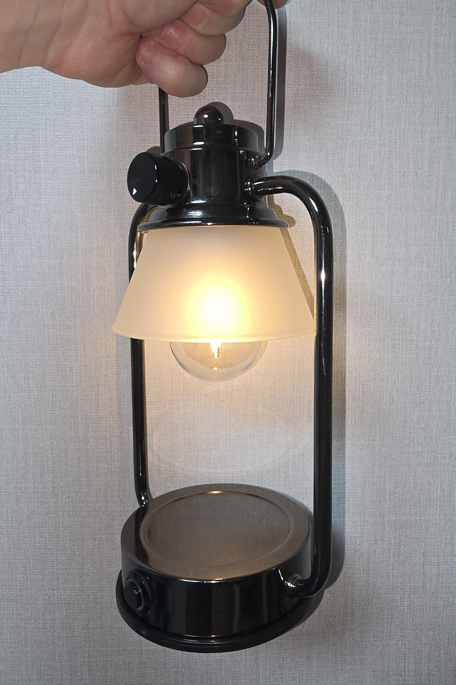

---

## Parts & Components

Most of the supplies for this project were obtained from Aliexpress but can probably be purchased elsewhere.

### ND1A05MA 5V UPS

The ND1A05MA module gives a reliable way to keep a battery charged safely but continue to use an external power source.  It also boosts the battery to 5V.  Note that the module may not output a full 5V unless the battery is attached, especially if running from an inferior DC source (like a computer).

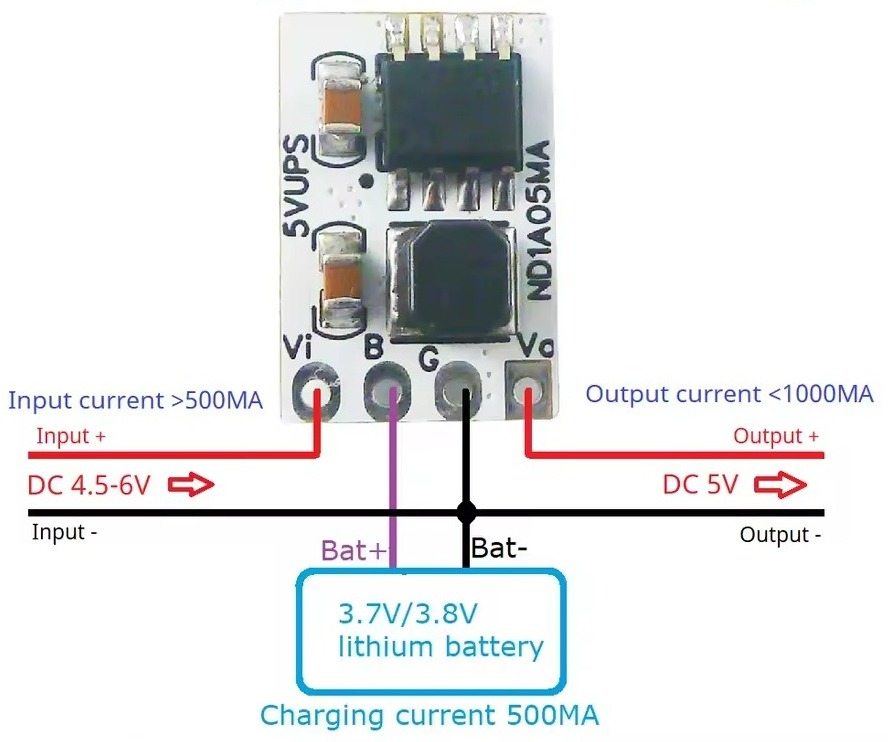

I'm pretty sure this is an "upgraded" version of the DD05CVSA which may be possible to use, too.

I do not recommend trying to substitute a TP4056 here because a circuit like this puts two loads and sources of power together.  It's just a terrible idea.

### IO15A01 Latch

This essentially acts as a switch to the LDO which should not receive power unless it has a load.  The power output can be toggled by pulling the Trigger pin to Ground.

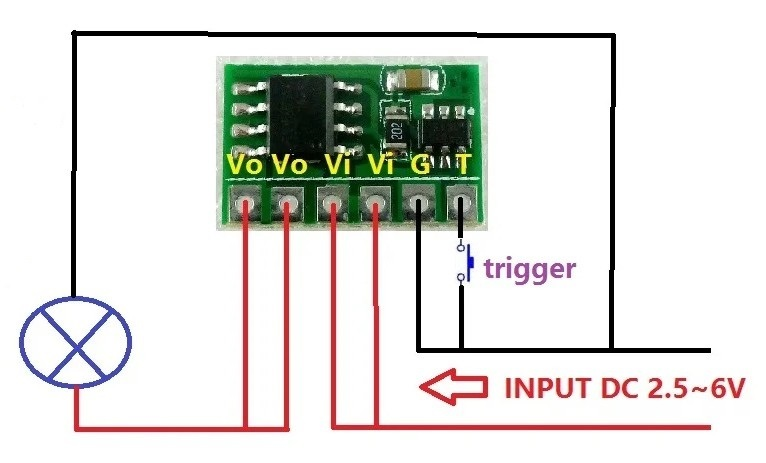

### LDO6AJSA Dimmer

The LDO (Low-Dropout Regulator) can control the voltage going to the bulb to dim the attached LED light bulb.  Because it doesn't use Pulse Width Modulation, it should be compatible with many types of 5V bulbs, including incandescent.

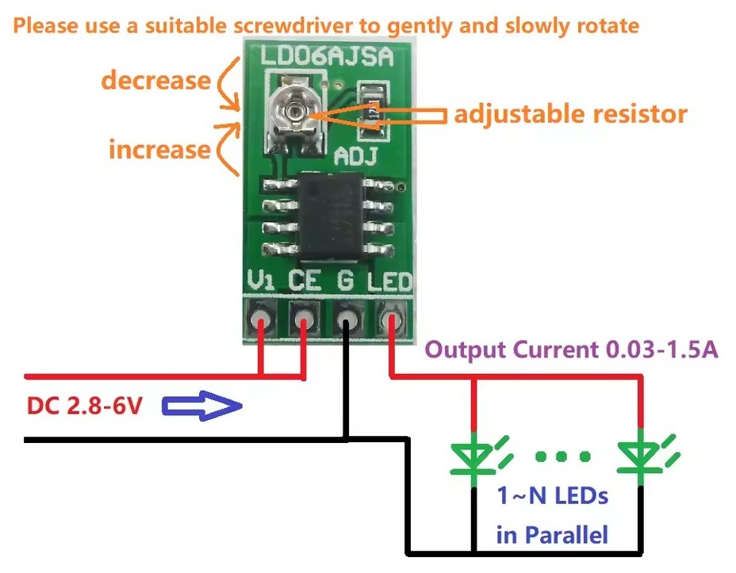

The onboard variable resistor is 50KΩ but you can wire an external linear potentiometer between 50KΩ and 500KΩ to achieve a more dim bulb.  Note that going higher means it becomes less linear, more sensitive on the "dim" side and less sensitive on the "bright" side.

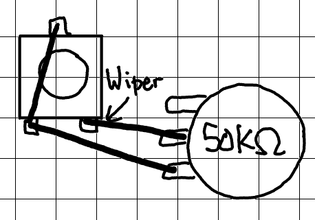

Note that two points are electrically the same.  You don't need to solder both points.

I tested a few potentiometers using a 5V input.  On brightest setting, power output was 4.9V.  There are diminishing returns for going higher.  In the end, I chose 100KΩ.

| Potentiometer | "Dim" Voltage Output | Note                                |
|---------------|----------------------|-------------------------------------|
| 50KΩ          | 2.93V                | very linear                         |
| 100KΩ         | 2.76V                | noticeably dimmer                   |
| 200KΩ         | 2.65V                | less linear, a bit dimmer           | 
| 500KΩ         | 2.59V                | very sensitive, extremely un-linear |

I learned about this LDO from [All About Circuits](https://forum.allaboutcircuits.com/ubs/a-small-cheap-cc-led-driver-module-that-is-worth-a-look-5-5.1794/).

Please note that this module can get extremely hot if powered on without a load.  When testing, always connect it to light of some kind.

### Links for Modules

I purchased all of these modules from the same seller on Aliexpress.  Here are links:
[ND1A05MA 5V UPS](https://www.aliexpress.com/item/1005006181813720.html),
[IO15A01 Latch](https://www.aliexpress.com/item/32795061369.html),
[LDO6AJSA Dimmer](https://www.aliexpress.com/item/1005003890314049.html).

### Other Parts & Components

The lamp was rescued from someone's trash.  I'll probably adapt this project to a proper storm lantern later.

For the bulb, I chose 5V E26 bulbs [here](https://www.aliexpress.com/item/1005004939460458.html).

I also bought sockets [here](https://www.aliexpress.com/item/1005004565747773.html) simply because the lamp I was working with had a GU10 socket.  The ceramic socket didn't fit so well, so I ended up breaking it with a hammer and jerry-rigging the metal bits together with nuts, bolts, silicone grommets, rubber o-rings, washers, and whatever else I had on hand.

The button is a black metal momentary switch with a built-in 3-6V LED from [here](https://www.aliexpress.com/item/1005006050728754.html).  A model with LED is (of course) completely optional.  I only use it to indicate battery charging status and when the ESP is booting.  Of course, you should pick a size and color appropriate to your lamp.

Potentiometers are cheap.  I got mine [here](https://www.aliexpress.com/item/1005005707840077.html).  You should probably get knobs that suit the lamp and fit the potentiometer.  I got mine [here](https://www.aliexpress.com/item/1005001394286414.html).

I use a 4-pin [female USB-C connector](https://www.aliexpress.com/item/1005007642773280.html) for power input and connectivity but you can use 2-pin or a DC plug or whatever you like if not adding the ESP32 board.  Actually I cut the hole too wide so I slapped in a DC port, too.  I may rarely use it.

If adding in the ESP32, you can add a [male USB-C connector](https://www.aliexpress.com/item/1005005317383478.html), a handful of resistors (mostly 100KΩ and a 10KΩ), some 100nF capacitors, a 2N3904 transistor, 1N5819 Schottky diodes, a 1N4148 switching diode, wire, and plenty of patience.

Note when using the male USB-C connector, the data lines are wired directly to the female while the Ground is common and the power input comes from the 5V UPS module.

Extremely important to note is that because the power is routed through the UPS before it gets to the ESP, it can try to draw too much power from a computer port (no problem on chargers) and since you may need to flash it now and then without opening it up again, I suggest adding a Schottky diode and tiny resistor (1Ω) as protection.

---

## Diagrams & Notes

Here is a diagram of the modules and how they connect.

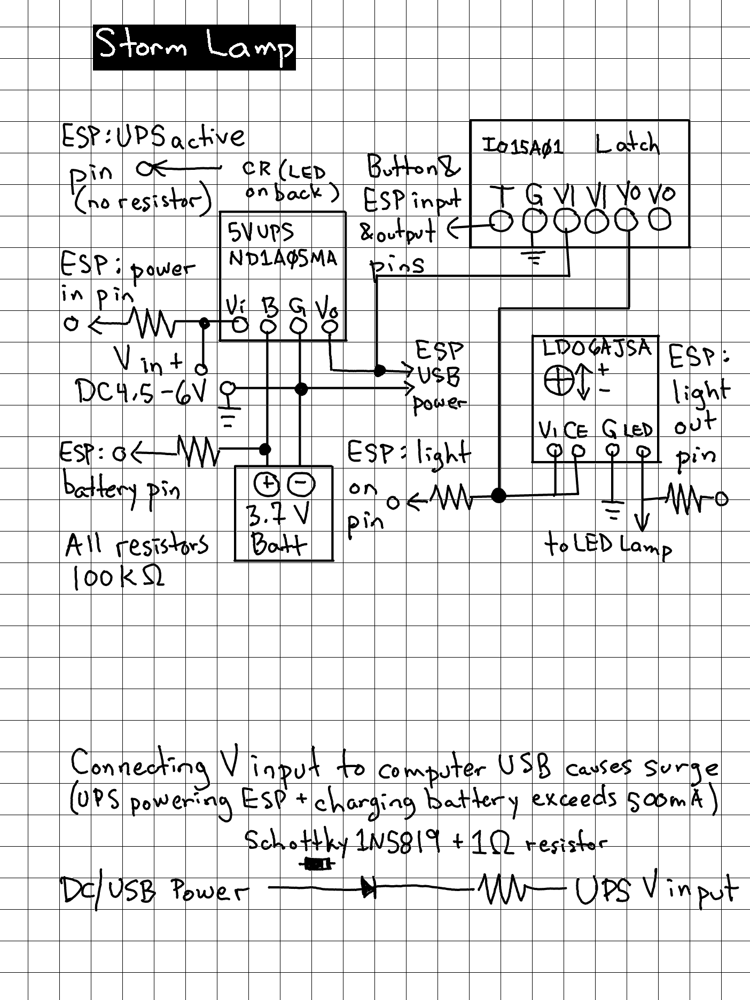

### Not Using an ESP

If not adding the ESP, simply omit any connection that indicates it's for an ESP.  It works extremely well without an ESP module.  The result is essentially a lamp with an always-charged battery backup and dimmer, which is still pretty cool.

Note that you can wire the CR LED on the UPS to your button LED if you would like an external charging indicator.  It may be pretty dim (because the output is less than 2V) or it may be pretty annoying (it blinks 3-5 times per second when the UPS is charging or discharging).  An LED blinking when on battery might be a bad thing.  I'd advise just removing the CR LED completely and using a button with no LED.

### Modifying the ESP32-S2

I chose an ESP32-S2 Mini because it's extremely efficient during deep sleep mode and has a small form factor.  You could probably use any ESP32-type board with a minimum of 2 ADC inputs.

Here is how to wire it up and add extra parts to the ESP32-S2.

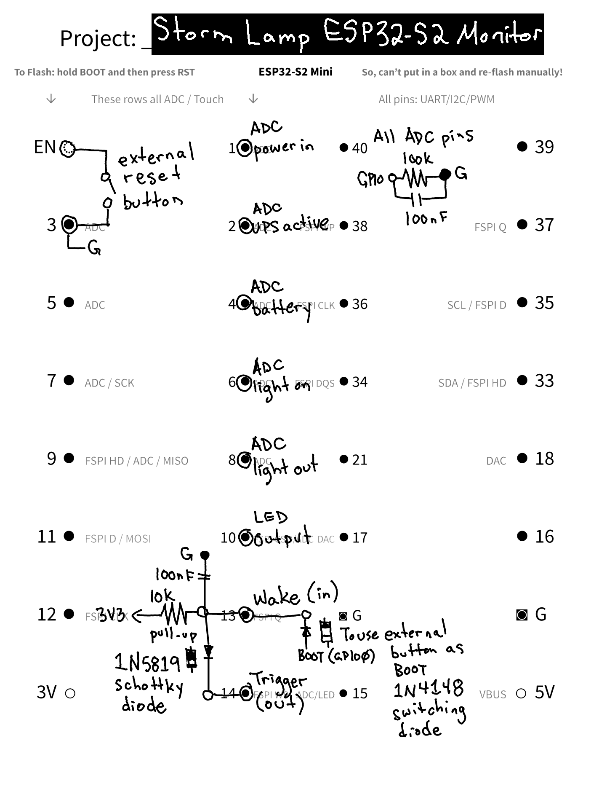

And here's the monstrosity of a result:

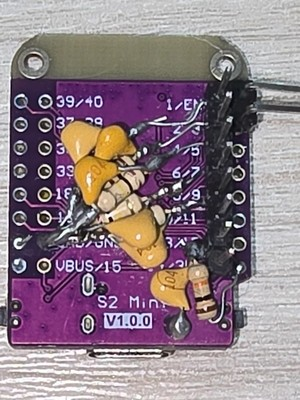 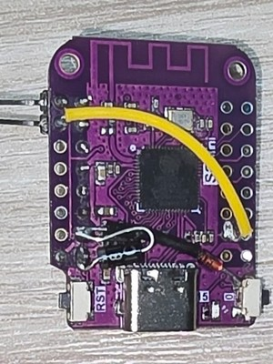

I wrapped 100nF capacitors around 100KΩ resistors and then put the resistor legs through the holes before jamming the pin header on and soldering.  The rest are soldered however I could get them on there.  You can (of course) change some pins but take note of which pins are capable of ADC reading first.

Because there's only one external button, I wanted the ability to use it for multiple functions.  Ordinarily (and without the ESP), the button is just used as a trigger for the latch which toggles power to the LDO and the bulb.  The latch should also be triggered by the ESP but ESPHome can only define a pin as an input or an output so we need to tie the two pins together if we want to detect button presses... actually 3 because GPIO0 is not exposed so we add the switching diode to the side of Button 0 and now we can use the same button to enter flashing mode. All these things are there to protect pins from affecting to each other in unintended ways.

Because there's no way to exit flashing mode (easily) without rebooting the ESP, I attached an external to EN and Ground.  To make attaching the switch more convenient, I tied the next pin to Ground and used angled pins.

### Note About UPS LED

I'm not entirely certain the ADC pin wired to the UPS led functions correctly.  The UPS LED continued to pulse even when the battery was full.  But it did so only with the ESP attached.  Without the ESP, it operated perfectly and stopped pulsing when the battery was fully-charged.  There's no danger of over-charging the battery so the breathing LED that indicates charging is handled in the software (when the battery is 4.2V, the pulsing output of CR is ignored).

### Inside

I make a personal choice to use mostly XH2.54 connectors with projects like this so modules can be swapped-out and re-wired if needed.  Because of some of the modifcations made to the modules, I added more pins than originally available (the UPS has an extra pin and the LDO has 2 extra pins).  How you handle these extra connections is up to you.  I also use a few SM2.54 connectors for connecting the battery and the lamp wires.

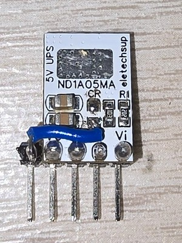 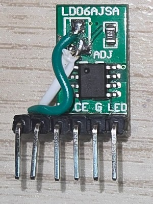

I also wrapped everything up in kapton tape because the metal body of the lamp is conductive.  Most of the wire work, soldering, etc. was done before pushing everything through the power input hole and gluing the USB and DC inputs in place but some things were finished after that.

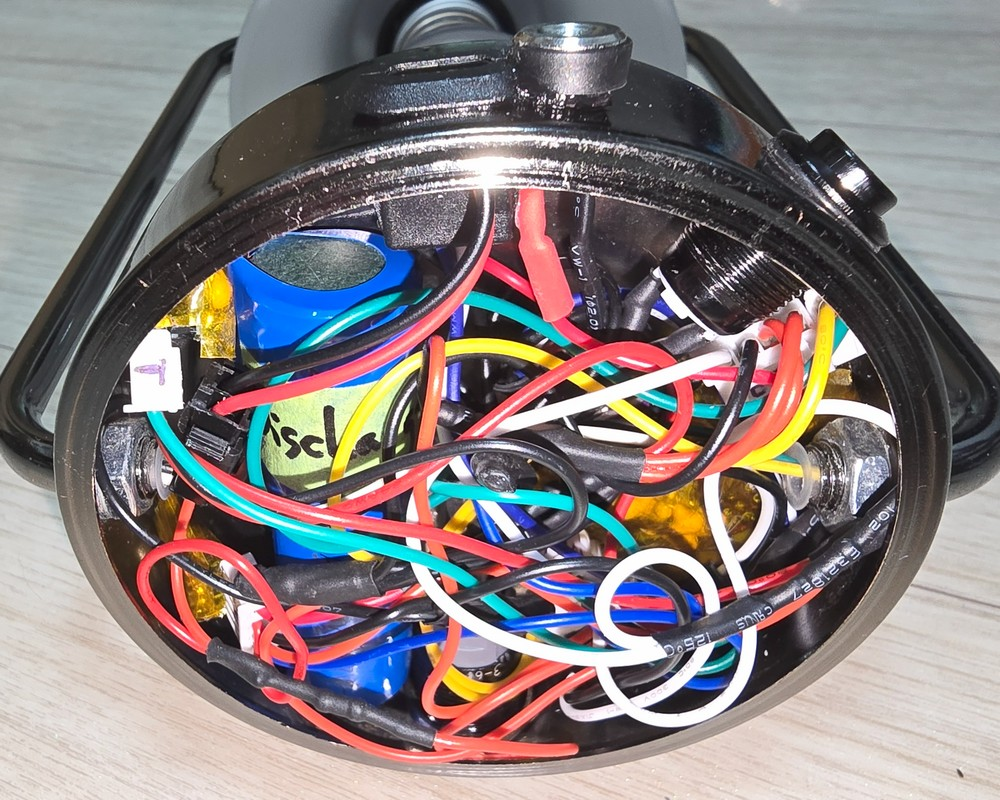

Any components in the diagram not directly attached to the ESP32-S2 board are actually in that mess of wires, wrapped in shrink wrap, especially the 100KΩ resistors used in the ADC measuring.  Inside the positive wire from the USB & DC power are the Schottky 1N5819 diode and 1Ω resistor. I put the 100KΩ in series to see how much power is going into the UPS but you can place it in parallel if you'd rather see how much total power is being supplied. Instead of 5V going into the UPS, it seems to be around 4.6V.  That's fine.

---

## ESPHome YAML

The file [`stormclock.yaml`](stormclock.yaml) has a lot of notes if you want to make changes.

The WebUI includes the ability to set the lamp to turn on when power is lost and turn off again when power is restored.  These options are on by default.

When power is lost, the ESP enters deep sleep mode for a configurable interval of time (default is 60 minutes).  Each wakeup is essentially a full reboot. Wi-fi is turned off at boot to save power but turned on if DC power is verified.  If power is not detected, the ESP will (very quickly) enter deep sleep mode.  Unfortunately, this means that mDNS is not available.  You will have to connect to the WebUI by IP address.  This can be obtained from your router, serial monitor, or Home Assistant.

I'm not entirely certain about Home Assistant integration.  Apparently, HA has no problem finding devices that have been added by IP address even when the IP address changes.  In any case, HA integration is completely optional.

If the battery is absent or too low, the ESP could enter brownout reboots and the lamp will flicker.  Ahead of the DC power-check is a check for battery.  The ESP will enter 24-hour deep sleep to keep the lamp operational.  If the lamp still flickers, Consider turning off the lamp, pressing the reset button, and waiting a few seconds before turning on the lamp again.  In any case, as stated before, the UPS isn't very stable without a battery.

Most importantly, the lamp will still be operable even when the ESP is asleep.  If you need to wake the ESP again, you can use the reset button.

### ESPHome ADC Warning

During building, you may see this warning.  It's safe to ignore for now.

```
In file included from src/esphome/components/adc/adc_sensor.h:9,
                 from src/esphome/components/adc/adc_sensor_common.cpp:1:
/config/.esphome/platformio/packages/framework-arduinoespressif32-libs/esp32s2/include/esp_adc/deprecated/include/esp_adc_cal.h:17:2:
warning: #warning "legacy adc calibration driver is deprecated, please migrate to use esp_adc/adc_cali.h and esp_adc/adc_cali_scheme.h" [-Wcpp]
   17 | #warning "legacy adc calibration driver is deprecated, please migrate to use esp_adc/adc_cali.h and esp_adc/adc_cali_scheme.h"
      |  ^~~~~~~
```
It's because ESPHome relies on some older code in ESP-IDF.  It's safe to ignore for now.

---

## Update History

| Date       | Release Notes    |
| ---------- | ---------------- |
| 2025.07.31 | First release    |
